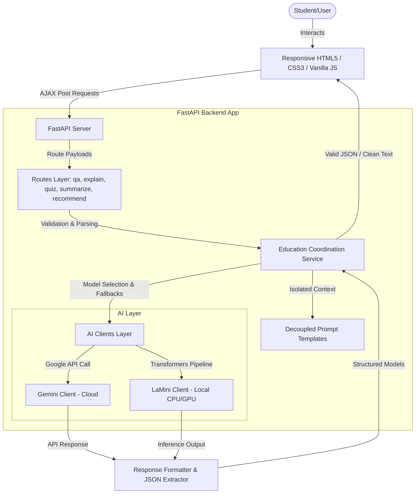

# EduGenie 🔮

EduGenie is a production-ready, high-fidelity AI-powered Educational Assistant designed to support students and self-learners. Powered by FastAPI, Google Gemini 1.5 Pro, and local HuggingFace LaMini-Flan-T5 models, it provides tutoring, concept explanations, interactive multiple-choice quiz generators, note summarization, and personalized learning roadmaps.

---

## Key Features

1. **Educational Q&A**: Submit complex academic questions and get detailed, step-by-step educational answers.
2. **Concept Explainer**: Explain concepts tailored for three learning stages:
   - **Beginner**: Simplifies terminology and uses everyday analogies.
   - **Intermediate**: Connects concepts and details real-world use cases.
   - **Advanced**: Deep-dives into technical architectures, comparisons, and mathematics.
3. **Interactive Quiz Generator**: Dynamically generates custom multiple-choice quizzes complete with interactive selection states and detailed answer explanations.
4. **Note Summarizer**: Distills textbook notes or chapters into Concise paragraphs, Detailed outlines, or clean Bullet-point summaries.
5. **Study Roadmap**: Formulates structured study pathways, timelines, curated resource guides, and practice challenges based on target goals and current experience levels.
6. **Dual-Model Coordination**: Automatically routes queries between Google Gemini (cloud) and LaMini-Flan-T5 (local pipeline), featuring intelligent fallbacks in case of credentials omission, format issues, or runtime disruptions.

---

## System Architecture

EduGenie is built on a clean, decoupled layer architecture separating presentation, endpoints, business coordination, and generative models:



---

## Folder Explanation

```
EduGenie/
├── app/
│   ├── main.py                 # FastAPI initialization, CORS, global error filters & root views
│   ├── config.py               # Environment configuration loader using python-dotenv
│   ├── routes/                 # Endpoint routers mapping schemas to services
│   │   ├── qa.py
│   │   ├── explain.py
│   │   ├── quiz.py
│   │   ├── summarize.py
│   │   └── recommend.py
│   ├── services/
│   │   └── education_service.py # Orchestrates prompt compilation, fallbacks, and model clients
│   ├── ai/                     # LLM service implementations
│   │   ├── gemini.py           # Google Generative AI integration with Flash fallbacks
│   │   └── lamini.py           # Lazy-loading HuggingFace pipeline for local model inference
│   ├── prompts/                # Isolated prompt templates (decoupled from endpoints)
│   │   ├── qa.py
│   │   ├── explain.py
│   │   ├── quiz.py
│   │   ├── summary.py
│   │   └── recommend.py
│   ├── models/
│   │   └── schemas.py          # Pydantic request and response contracts
│   ├── utils/                  # Helper modules
│   │   ├── logger.py           # Integrated file + console logger
│   │   ├── validators.py       # Input bounds and size validators
│   │   └── formatter.py        # Safe LLM JSON extraction utilities
│   ├── templates/
│   │   └── index.html          # Semantic HTML dashboard template
│   └── static/                 # Static asset directories
│       ├── css/
│       │   └── style.css       # High-fidelity glassmorphic layout stylesheet
│       └── js/
│           └── app.js          # Tab routing, AJAX calls, interactive quiz elements, roadmap compilers
├── .env                        # Local active environment secrets (Git ignored)
├── .env.example                # Example template configuration
├── .gitignore                  # Git untracked settings
├── requirements.txt            # System dependency packages list
├── verify_endpoints.py         # Mocked API endpoint test validation suite
└── README.md                   # Project documentation
```

---

## Installation & Setup

### Prerequisites
- Python 3.11 or higher (Python 3.14.1 recommended)
- Git (optional)

### Step 1: Clone or Copy the Repository
Navigate to the root directory where the code is located:
```bash
cd "c:/Users/sivan/OneDrive/Desktop/Partnr Network/AI App/EduGenie"
```

### Step 2: Create a Virtual Environment
If not already created, spin up a Python virtual environment:
```bash
python -m venv .venv
```

### Step 3: Activate Environment & Install Dependencies
Activate the virtual environment and install standard requirements:
**On Windows PowerShell:**
```powershell
.venv\Scripts\Activate.ps1
pip install -r requirements.txt
```
**On Windows Command Prompt (CMD):**
```cmd
.venv\Scripts\activate.bat
pip install -r requirements.txt
```

*Note: Torch and Transformers will download packages to support local models. Standard wheels are automatically fetched by pip.*

### Step 4: Configure API Credentials
1. Duplicate `.env.example` as `.env`:
   ```bash
   cp .env.example .env
   ```
2. Open `.env` and fill in your Google Gemini API key:
   ```env
   GEMINI_API_KEY=AIzaSyYourActualKeyHere
   ```
   *You can get a free developer key from [Google AI Studio](https://aistudio.google.com/).*

---

## Running Locally

To start the FastAPI web server, run:
```bash
.venv\Scripts\python -m uvicorn app.main:app --reload --host 127.0.0.1 --port 8000
```

Once started:
1. Open your browser and navigate to **`http://localhost:8000`** to interact with the dashboard.
2. If debug mode is active, view the interactive Swagger API documentation at **`http://localhost:8000/docs`**.

---

## Endpoint API Reference

All JSON requests require the header `"Content-Type: application/json"`.

### 1. Question Answering
- **Path**: `POST /qa`
- **Request Body**:
  ```json
  {
    "question": "Explain the difference between compiler and interpreter.",
    "model_preference": "gemini" 
  }
  ```
- **Response**:
  ```json
  {
    "question": "Explain the difference between compiler and interpreter.",
    "answer": "Compilers translate code entirely before execution, while interpreters...",
    "model_used": "Gemini 1.5 Pro"
  }
  ```

### 2. Concept Explainer
- **Path**: `POST /explain`
- **Request Body**:
  ```json
  {
    "concept": "Binary Search",
    "level": "Beginner",
    "model_preference": "gemini"
  }
  ```
- **Response**:
  ```json
  {
    "concept": "Binary Search",
    "level": "Beginner",
    "explanation": "Imagine you are searching for a name in a phone book...",
    "model_used": "Gemini 1.5 Pro"
  }
  ```

### 3. Quiz Generator
- **Path**: `POST /quiz`
- **Request Body**:
  ```json
  {
    "topic": "Python Dicts",
    "difficulty": "Medium",
    "num_questions": 3,
    "model_preference": "gemini"
  }
  ```
- **Response**:
  ```json
  {
    "topic": "Python Dicts",
    "difficulty": "Medium",
    "questions": [
      {
        "questionText": "Which method removes all elements from a dictionary?",
        "options": ["clear()", "remove()", "delete()", "pop()"],
        "correctAnswer": "clear()",
        "explanation": "The clear() method removes all items from the dictionary in-place."
      }
    ],
    "model_used": "Gemini 1.5 Pro"
  }
  ```

### 4. Text Summarization
- **Path**: `POST /summarize`
- **Request Body**:
  ```json
  {
    "text": "Pasted notes content...",
    "format": "Bullet-point",
    "model_preference": "gemini"
  }
  ```
- **Response**:
  ```json
  {
    "original_length": 523,
    "summary_length": 128,
    "summary": "- Key Point 1...\n- Key Point 2...",
    "format": "Bullet-point",
    "model_used": "Gemini 1.5 Pro"
  }
  ```

### 5. Study Roadmap Recommendations
- **Path**: `POST /recommend`
- **Request Body**:
  ```json
  {
    "topic": "FastAPI",
    "skill_level": "Beginner",
    "goals": "Build a REST API to serve database records",
    "model_preference": "gemini"
  }
  ```
- **Response**:
  ```json
  {
    "topic": "FastAPI",
    "skill_level": "Beginner",
    "goals": "Build a REST API to serve database records",
    "roadmap": [
      {
        "phase": "Phase 1: Setup",
        "title": "Install and Run Hello World",
        "description": "Install fastapi and uvicorn, run basic router",
        "duration": "1 day"
      }
    ],
    "resources": [
      {
        "name": "Official FastAPI Tutorial",
        "type": "Course",
        "description": "Best place to start learning decorators"
      }
    ],
    "practice_suggestions": [
      "Create a GET request returning JSON items"
    ],
    "model_used": "Gemini 1.5 Pro"
  }
  ```

### 6. Health Check
- **Path**: `GET /health`
- **Response**:
  ```json
  {
    "status": "operational",
    "gemini_api_set": true,
    "default_provider": "gemini",
    "lamini_model_name": "MBZUAI/LaMini-Flan-T5-248M"
  }
  ```

---

## Testing & Verification
Unit tests are written using `unittest` and FastAPI's `TestClient` in `verify_endpoints.py`. Mocks are implemented to isolate testing from external network connections and GPU memory requirements.

To run the verification suite:
```bash
.venv\Scripts\python verify_endpoints.py
```

---

## Future Improvements
- **Persistent Progress tracking**: Add databases (SQLite/PostgreSQL) to store student profiles, roadmaps, and completed quizzes.
- **RAG Notes Upload**: Allow PDF upload and query notes directly via vector database integration (FAISS/Chroma).
- **Interactive Speech**: Convert explanations to audio responses using TTS (Text-to-Speech) pipelines.
# GenAI

